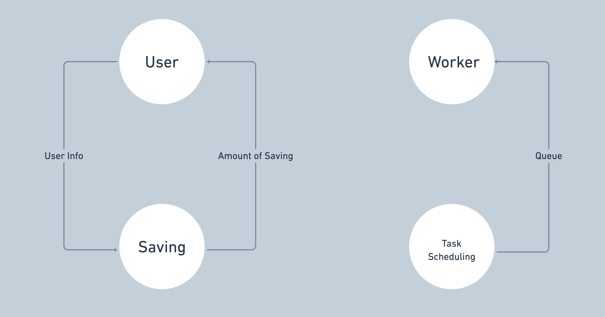
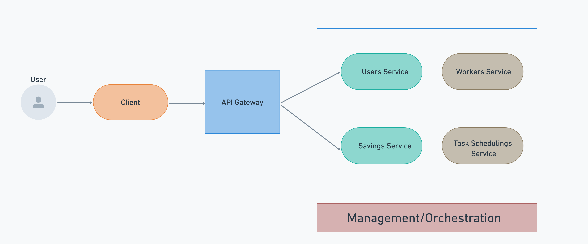
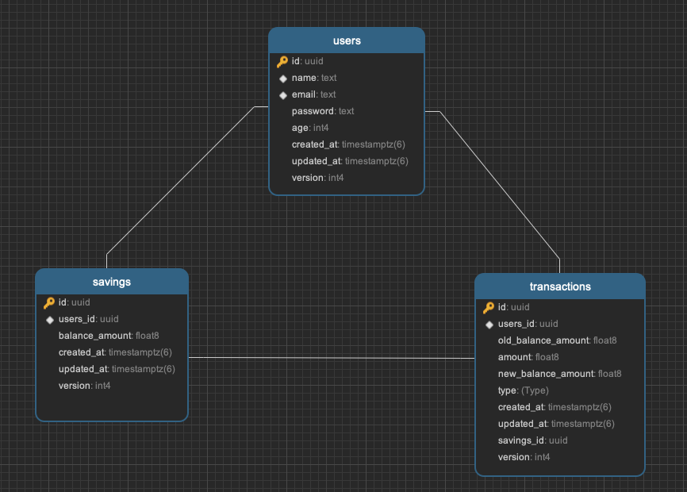
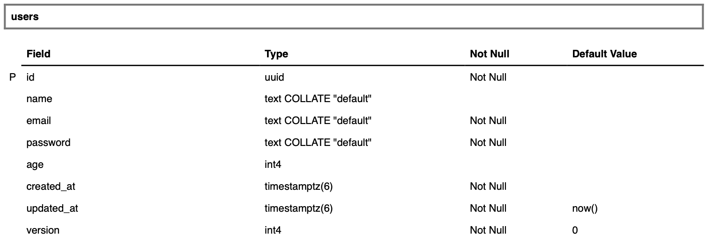
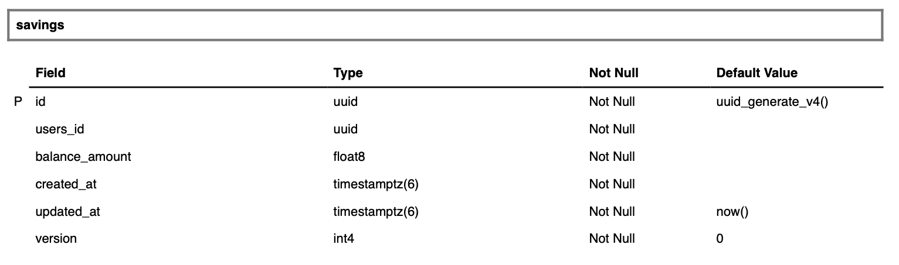
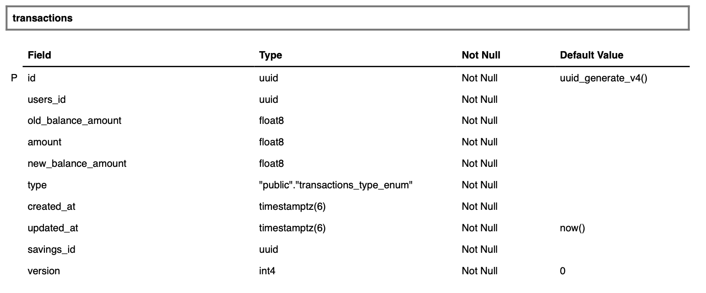

# Infina Tech Lead - Architecture System Design Mini Project

NestJS GraphQL API + gRPC microservices + RabbitMQ

This project is a mono-repository containing a [GraphQL](https://graphql.org/) API with [gRPC](https://grpc.io/) back-end microservices and [RabbitMQ](https://www.rabbitmq.com/) for queue built using the [NestJS framework](https://nestjs.com/).

## Graph Model

A diagram of the graph data model is shown below.

### Explanation

1. Each User has a savings account with the money in it.
2. Each Saving is associated with a single user. Contains information about the amount in a savings account.
3. Task Scheduling is a Cron Job that is launched every day at 23:59:00 every day (Can be set up in Env) which is responsible for getting the Savings list of all customers in the Database into parts (Each Part contains a certain number of Saving accounts, the number of Parts can be configured in Env) and pushing it to the Queue.
4. The Worker reads all the Messages in the Queue. Process data to add savings interest to savings accounts.

## Architecture Overview

The GraphQL API acts as a gateway/proxy for the different microservices it exposes. The resolvers of the GraphQL API make calls to the gRPC microservices through client-server communication. The services and the data interchange are defined using [Protocol Buffers](https://developers.google.com/protocol-buffers/). The gRPC microservices handle and fulfill the requests whether they are database or storage operations or any other internal or external calls.

### Diagram

A diagram of the architecture is shown below.

This architecture implements the following Microservice Design Patterns:

1. [Microservice Architecture](https://microservices.io/patterns/microservices.html)
2. [Subdomain Decomposition](https://microservices.io/patterns/decomposition/decompose-by-subdomain.html)
3. [Externalized Configuration](https://microservices.io/patterns/externalized-configuration.html)
4. [Remote Procedure Invocation](https://microservices.io/patterns/communication-style/rpi.html)
5. [API Gateway](https://microservices.io/patterns/apigateway.html)
6. [Database per Service](https://microservices.io/patterns/data/database-per-service.html)

### Database Design

1. Users table for Users Service

- Contains basic information on Customer

2. Savings and Transactions for Savings Service

- Savings: store passbook and balance information
- Transactions: store transaction information such as Deposit, Withdraw and Saving. Each event that changes the balance in the passbook corresponds to a row of data in this table.
  
  

## Layers

### API Layer

[NestJS + GraphQL](https://nestjs.com/) acts as the API Layer for the architecture. It takes care of listening for client requests and calling the appropriate back-end microservice to fulfill them.

### Microservice Layer

[NestJS + gRPC](https://grpc.io/) was chosen as the framework to do the microservices. [Protocol buffers](https://developers.google.com/protocol-buffers/) was used as the data interchange format between the client (GraphQL API) and the server (gRPC microservices). NestJS is still the framework used to create the gRPC Microservices.

### Persistence Layer

PostgreSQL is used as the database and [Sequelize](https://sequelize.org) is used as the Object-Relational Mapper (ORM).

### Message Queuing Layer

In this project, I use RabbitMQ to build a Queue system. A message queue is a form of asynchronous service-to-service communication used in serverless and microservices architectures. Messages are stored on the queue until they are processed and deleted. Each message is processed only once, by a single consumer. Message queues can be used to decouple heavyweight processing, to buffer or batch work, and to smooth spiky workloads.

## Deployment

Deployment is done with containers in mind. A Docker Compose file along with Dockerfiles for the GraphQL API Gateway and each microservice are given to run the whole thing on any machine. For production, use [Kubernetes](https://kubernetes.io/) for these kinds of microservices architecture to deploy in production. [Istio](https://istio.io/) takes care of service discovery, distributed tracing and other observability requirements.

## How to Run

### Pre-requisites

You must install the following on your local machine:

1. Node.js (v14.x recommended)
2. Docker
3. Docker Compose
4. PostgreSQL Client (libpq as required by [pg-native](https://www.npmjs.com/package/pg-native#install))
5. RabbitMQ

### Running

1. On the Terminal, go into the project's root folder (`cd /project/root/folder`) and execute `npm start`. The start script will install all npm dependencies for all projects, transpile the code, build the artifacts (Docker images) and run all of them via `docker-compose`.

2. Once the start script is done, the GraphQL Playground will be running on [http://localhost:3000](http://localhost:3000)

References:

1. https://www.apollographql.com/docs/federation/
2. https://www.apollographql.com/docs/federation/federation-2/new-in-federation-2
3. https://github.com/apollographql/supergraph-demo-fed2
4. https://github.com/benjsicam/nestjs-graphql-microservices
5. https://www.apollographql.com/docs/federation/federation-spec/
6. https://docs.nestjs.com/graphql/migration-guide
7. https://docs.nestjs.com/graphql/federation
